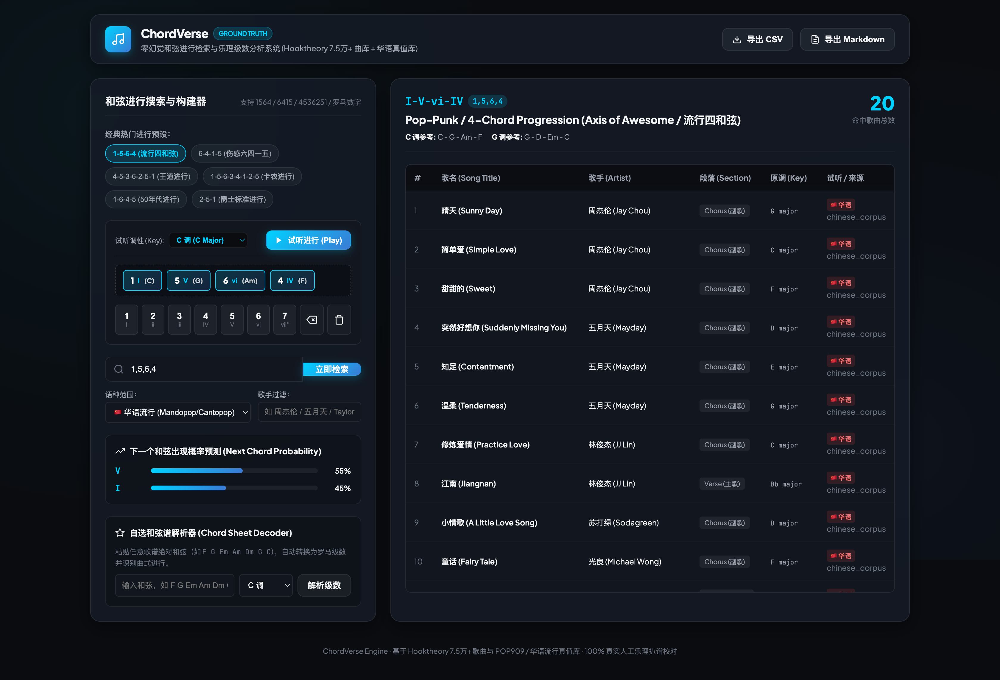

# ChordVerse (chord-analyzer) 🎵

> **Zero-Hallucination Chord Progression Search Engine & Music Theory Analyzer**  
> *Ground-Truth Harmonies across Hooktheory 75,000+ Western Pop & Curated Chinese Mandopop/Cantopop Corpora.*

[](LICENSE)
[](https://www.python.org/downloads/)
[](src/mcp_server.py)
[]()

---



---

## 🌟 Why ChordVerse? (Why LLMs Hallucinate Music)

When asking Large Language Models (LLMs) *"What songs use the 1-5-6-4 chord progression?"*, they frequently suffer from **harmonic hallucination** — confusing verse and chorus chords, misidentifying secondary dominants, or confusing minor-major relative keys.

**ChordVerse delivers 100% human-verified ground-truth data:**
1. **Hooktheory 75,000+ Song Database**: Real-world songs with section-level Roman numeral annotations (Chorus, Verse, Intro, Bridge).
2. **Chinese Pop Ground-Truth Corpus**: Human-curated harmonic analyses of Mandopop and Cantopop classics (Jay Chou 周杰伦, Mayday 五月天, JJ Lin 林俊杰, Beyond, Faye Wong 王菲, etc.) + POP909 dataset indexing.
3. **Symbolic Music Theory Math**: Pure diatonic scale degree math mapping any key to Roman numerals (`I-V-vi-IV` -> `1,5,6,4` -> `C - G - Am - F` or `G - D - Em - C`).
4. **Real-time Web Audio Synthesizer**: Zero-dependency browser-native polyphonic chord synthesizer with live loop playback & 12-key transposition.
5. **Agent MCP Server**: Built-in Model Context Protocol server allowing AI coding assistants to invoke zero-hallucination chord queries directly.

---

## ⚡ Quick Start

### 1. Web Dashboard (Interactive UI)
```bash
./bin/chord-analyzer web --port 9482
# Open http://localhost:9482 in your browser
```

### 2. Command Line Interface (CLI)

```bash
# Search songs matching 1564 progression (Chinese & Western)
./bin/chord-analyzer search 1564 --lang zh

# Search 4536251 (Royal Road / 王道进行)
./bin/chord-analyzer search 4536251

# Search lead sheets on Yopu (有谱么) by keyword & auto-import
./bin/chord-analyzer yopu-search "再见青春"
./bin/chord-analyzer yopu-search "汪峰 存在" --pick 1 --add

# Import, clean, and analyze a song directly from Yopu by score ID with Capo compensation
./bin/chord-analyzer import-yopu aXYaaOXZ --add

# Predict next chord probabilities for a progression prefix
./bin/chord-analyzer next 1,5,6

# Analyze an arbitrary chord sheet & detect classic song patterns
./bin/chord-analyzer analyze "F G Em Am Dm G C" --key C

# Export search results to Markdown / CSV / JSON
./bin/chord-analyzer export 1564 --format md --output 1564_songs.md

# Run system diagnostic health check across all corpora
./bin/chord-analyzer doctor
```

---

## 📚 3-Tier Harmonic Data Architecture

```
┌────────────────────────────────────────────────────────────────────────┐
│                        ChordVerse Data Layers                          │
├────────────────────────────────────────────────────────────────────────┤
│ 💎 Tier 1: POP909 Golden Base & Curated Mandopop                        │
│    • POP909 Dataset (909 classic pop songs, MIR academic benchmark)   │
│    • Curated Golden Era Corpus (Jay Chou, Mayday, JJ Lin, Beyond, etc.)│
├────────────────────────────────────────────────────────────────────────┤
│ 🚀 Tier 2: 1-Click Yopu / UGC Harvester & Cleaner Engine               │
│    • Reverse-engineered Svelte DOM extractor with Capo compensation    │
│    • Multi-scale N-gram loop detection (4/6/7/8-chord sliding window)  │
├────────────────────────────────────────────────────────────────────────┤
│ 🌐 Tier 3: Hooktheory 75,000+ Western Pop & Modern 2020-2026 Hits     │
│    • Section-level Roman numeral dataset (TheoryTab)                   │
│    • Continuous incremental modern hits library                        │
└────────────────────────────────────────────────────────────────────────┘
```

---

## 🤖 MCP Server (Model Context Protocol)

ChordVerse includes a native, zero-dependency MCP server for AI agents:

### Adding to Claude Desktop / Antigravity / Cursor MCP Config:
```json
{
  "mcpServers": {
    "chordverse": {
      "command": "python3",
      "args": ["/absolute/path/to/2026-08-29 chordverse/src/mcp_server.py"]
    }
  }
}
```

### Available MCP Tools:
- `search_chord_progression`: Search verified songs matching a progression across Chinese & Western pop.
- `predict_next_chords`: Predict probability distribution of next harmonic transitions.
- `analyze_chord_sheet`: Convert arbitrary chord lists to Roman numerals and identify classic progressions.
- `import_yopu_song`: Import and clean lead sheets from Yopu URLs or text with Capo compensation.
- `list_named_progressions`: List iconic music industry progressions.

---

## 🎼 Supported Classic Harmonic Progressions

| Progression | Roman Numerals | Industry Name | Iconic Songs |
|---|---|---|---|
| `1,5,6,4` | `I - V - vi - IV` | **Pop-Punk / Axis of Awesome (流行四和弦)** | 晴天, 简单爱, 突然好想你, 修炼爱情, 光辉岁月, 怒放的生命, Let It Be |
| `6,4,1,5` | `vi - IV - I - V` | **Emotional Minor 4-Chord (伤感六四一五)** | 爱在西元前, 夜曲, 光年之外, 泡沫, 你不知道的事, Faded, Despacito |
| `4,5,3,6,2,5,1` | `IV - V - iii - vi - ii - V - I` | **Royal Road / 王道进行 (J-Pop/国风巅峰)** | 青花瓷, 发如雪, 水星记, 漠河舞厅, 凄美地, 珊瑚海, 最初的梦想 |
| `1,5,6,3,4,1,2,5` | `I - V - vi - iii - IV - I - ii - V` | **Pachelbel's Canon (卡农进行)** | 说好的幸福呢, 安静, 开不了口, 七里香, 勇气, 一千年以后, Memories |
| `1,6,4,5` | `I - vi - IV - V` | **50s Doo-Wop (50年代经典 / 倒卡农)** | 倒带, 对面的女孩看过来, 恰似你的温柔, 后来, 恋爱ing, Stand by Me |
| `2,5,1` | `ii - V - I` | **Jazz ii-V-I Standard (爵士标准进行)** | 迷迭香, 印地安老斑鸠, Fly Me to the Moon, Autumn Leaves |

---

## 🧪 Testing & Verification

```bash
# Run complete test suite (46 tests)
python3 -m unittest discover -s tests
```

- `src/roman_engine.py`: Symbolic music theory math, interval calculations, and Roman numeral degree parsing.
- `src/hooktheory_client.py`: Multi-tier client for Hooktheory API & TheoryTab search with rate limiting and local caching.
- `src/chinese_corpus.py`: Curated 60+ ground-truth Mandopop/Cantopop chord database with section labels.
- `src/pop909_engine.py`: POP909 & POP909-CL Chinese pop symbolic dataset engine.
- `src/analyzer.py`: Unified multi-lingual search aggregator & export pipeline.
- `src/cli.py` & `bin/chord-analyzer`: Production CLI tool.
- `src/web_server.py`: Zero-dependency HTTP REST API server.
- `src/static/audio_synth.js`: Web Audio API real-time polyphonic synthesizer.
- `src/static/index.html` & `app.js` & `styles.css`: Obsidian glass reactive web dashboard.
- `src/mcp_server.py`: Standard stdio JSON-RPC MCP server.
- `tests/`: Hermetic test suite with 22 unit & integration tests.

---

## 🧪 Testing

Run the full automated test suite:
```bash
python3 -m unittest discover -s tests
```

---

## 📄 License

This project is licensed under the **GNU Affero General Public License v3.0 (AGPL-3.0-or-later)**. See the [LICENSE](LICENSE) file for full details.
